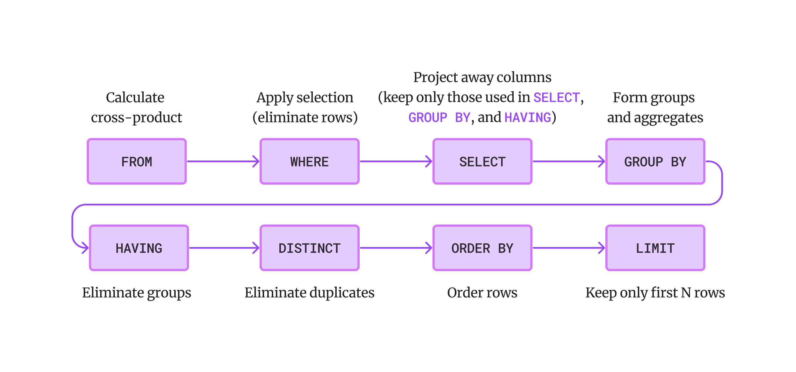

## Basic queries

```
SELECT [DISTINCT] <column-expression>
FROM   <table>
[WHERE <predicate>]
```

-   Produces all tuples that satisfy the predicate.
-   Outputs the expressions in the `SELECT` list.
-   Expressions can be column references, or an arithmetic expressions.

## Uniqueness

```
SELECT DISTINCT colors
FROM   Boats;
```

-   `DISTINCT` removes duplicate rows from the output.

## String comparisons

```
SELECT sname
FROM   Sailors
WHERE  sname LIKE 'A%';

SELECT sname
FROM   Sailors
WHERE  sname REGEXP 'A.*';
```

-   These two queries are equivalent.

## Order

```
SELECT sname, age
FROM   Sailors
ORDER  BY sname;
```

-   `ORDER BY` specifies that the rows should be ordered
    lexicographically.
-   It must refer to columns that are in the output.

## Ascending or descending

```
SELECT sname, age
FROM   Sailors
ORDER  BY age ASC, sname DESC;
```

-   Ascending order is used by default.
-   `DESC` and `ASC` can be used to change the order.
-   Can mix and match.

## LIMIT

```
SELECT sname, age
FROM   Sailors
ORDER  BY age
LIMIT  5;
```

-   `LIMIT` specifies the maximum number of rows to output.
-   Typically used with `ORDER BY`, otherwise the output is
    *non-deterministic*.

## Aggregates

```
SELECT AVG(age)
FROM   Sailors;
```

-   An aggregate computes a summary of some arithmetic expression.
-   It produces one row of output.
-   Other aggregates: `SUM`, `COUNT`, `MAX`, `MIN`.

## Column names

```
SELECT AVG(age) AS "age average"
FROM   Sailors;
```

## Groups

```
SELECT age, AVG(rating) AS "rating average"
FROM Sailors
GROUP BY age;
```

-   `GROUP BY` partitions the output into groups with the same column
    values.
-   It produces an aggregate result per group.

## Filtering groups

```
SELECT age, AVG(rating) AS "rating average"
FROM Sailors
GROUP BY age
HAVING COUNT(age) > 1;
```

-   The `HAVING` predicate filters groups.
-   It is applied *after* grouping and aggregation.
-   It can only be used in aggregate queries.

## Distinct aggregates

```
SELECT COUNT(DISTINCT age)
FROM Sailors;
```

```
SELECT DISTINCT COUNT(age)
FROM Sailors;
```

-   These two queries are *not* equivalent.

## Table aliases

```
SELECT S.sname, S.age
FROM Sailors S
WHERE S.age > 30;
```

## Conceptual evaluation strategy



## Join queries

```
SELECT S.sname, R.day
FROM   Sailors S, Reserve R
WHERE  S.sid = R.sid;
```

-   Join queries allow us to output data from a *cross-product* of
    multiple tables.

## Cross product

```
SELECT * FROM Sailors, Reserves;
```

-   All pairs of tuples, concatenated.

## Cross product (continued)

| sid |  sname  | rating | age | sid | bid |   day    |
|-----|---------|--------|-----|-----|-----|----------|
| 22  | Dustin  | 7      | 45  | 22  | 101 | 10/10/98 |
| 22  | Dustin  | 7      | 45  | 22  | 102 | 10/10/98 |
| 22  | Dustin  | 7      | 45  | 22  | 103 | 10/8/98  |
| 22  | Dustin  | 7      | 45  | 22  | 104 | 10/7/98  |
| 22  | Dustin  | 7      | 45  | 31  | 102 | 11/10/98 |
| 22  | Dustin  | 7      | 45  | 31  | 103 | 11/6/98  |
| 22  | Dustin  | 7      | 45  | 31  | 104 | 11/12/98 |
| 22  | Dustin  | 7      | 45  | 64  | 101 | 9/5/98   |
| 22  | Dustin  | 7      | 45  | 64  | 102 | 9/8/98   |
| 22  | Dustin  | 7      | 45  | 74  | 103 | 9/8/98   |
| ... | ...     | ...    | ... | ... | ... | ...      |

## Self-join queries

```
SELECT S.sname AS "Senior", S.age AS "Age",
       J.sname AS "Junior", J.age AS "Age"
FROM   Sailors S, Sailors J
WHERE  S.age > J.age;
```

-   Output: pairs of senior-junior relationship.

## Set semantics

```
R = { A, A, A, A, B, B, C, D }
S = { A, A, B, B, B, C, E }
```

-   Union: `{ A, B, C, D, E }`
-   Intersect: `{ A, B, C }`
-   Except: `{ D }`

## Multiset semantics

```
R = { A, A, A, A, B, B, C, D } = { A(4), B(2), C(1), D(1) }
S = { A, A, B, B, B, C, E } = { A(2), B(3), C(1), E(1) }
```

-   Union all (sum): `{ A(4+2), B(2+5), C(1+1), D(1+0), E(0+1) }`
-   Intersect all (minimum): `{ A(min(4,2)), B(min(2,5)), C(min(1,1)),
    D(min(1,0)), E(min(0,1)) }`
-   Except all (difference): `{ A(4-2), B(2-5), C(1-1), D(1-0), E(0-1) }`


## Union

```
SELECT R.sid
FROM   Boats B, Reserves R
WHERE  R.bid = B.bid
       AND (B.color = 'red' OR B.color = 'green');

---

SELECT R.sid
FROM   Boats B, Reserves R
WHERE  R.bid = B.bid AND B.color = 'red'

UNION ALL

SELECT R.sid
FROM   Boats B, Reserves R
WHERE  R.bid = B.bid AND B.color = 'green';
```

-   `sid` of sailors who reserved a red **or** green boat.
-   These two queries are equivalent.

## Intersect

```
SELECT R.sid
FROM   Boats B, Reserves R
WHERE  R.bid = B.bid
       AND (B.color = 'red' AND B.color = 'green');

---

SELECT R.sid
FROM   Boats B, Reserves R
WHERE  R.bid = B.bid AND B.color = 'red'

INTERSECT

SELECT R.sid
FROM   Boats B, Reserves R
WHERE  R.bid = B.bid AND B.color = 'green';
```

-   `sid` of sailors who reserved a red **and** green boat.
-   These two queries are equivalent.

## Except

```
SELECT R.sid
FROM   Boats B, Reserves R
WHERE  R.bid = B.bid AND B.color = 'red'

EXCEPT

SELECT R.sid
FROM   Boats B, Reserves R
WHERE  R.bid = B.bid AND B.color = 'green';
```

-   `sid` of sailors who reserved a red boat, **but not** a green boat.

## Nested queries

```
SELECT S.sname
FROM   Sailors S
WHERE  S.sid IN (SELECT R.sid
                 FROM   Reserves R
                 WHERE  R.bid = 102);
```

-   What is the names of sailors who have reserved boat #102?

## Nested queries (not in)

```
SELECT S.sname
FROM   Sailors S
WHERE  S.sid NOT IN (SELECT R.sid
                     FROM   Reserves R
                     WHERE  R.bid = 103);
```

-   What is the names of sailors who have *not* reserved boat #103?

